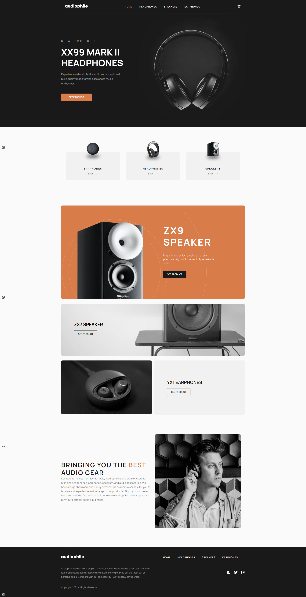

# Frontend Mentor - Audiophile e-commerce website solution

This is a solution to the [Audiophile e-commerce website challenge on Frontend Mentor](https://www.frontendmentor.io/challenges/audiophile-ecommerce-website-C8cuSd_wx). Frontend Mentor challenges help you improve your coding skills by building realistic projects.

## Table of contents

- [Overview](#overview)
  - [The challenge](#the-challenge)
  - [Screenshot](#screenshot)
  - [Links](#links)
  - [Setup](#setup)
- [My process](#my-process)
  - [Built with](#built-with)
  - [What I learned](#what-i-learned)
- [Author](#author)

## Overview

### The challenge

Users should be able to:

- View the optimal layout for the app depending on their device's screen size :heavy_check_mark:
- See hover states for all interactive elements on the page :heavy_check_mark:
- Add/Remove products from the cart :heavy_check_mark:
- Edit product quantities in the cart :heavy_check_mark:
- Fill in all fields in the checkout :heavy_check_mark:
- Receive form validations if fields are missed or incorrect during checkout :heavy_check_mark:
- See correct checkout totals depending on the products in the cart :heavy_check_mark:
  - Shipping always adds $50 to the order :heavy_check_mark:
  - VAT is calculated as 20% of the product total, excluding shipping :heavy_check_mark:
- See an order confirmation modal after checking out with an order summary :heavy_check_mark:
- **Bonus**: Keep track of what's in the cart, even after refreshing the browser (`localStorage` could be used for this if you're not building out a full-stack app) :heavy_check_mark:

### Screenshot

### Links
https://exquisite-praline-0e0349.netlify.app/
### Setup

To run this project locally:

npm install 
     &&
npm start

## My process

### Built with

- React.js
- React-router-dom
- Material UI
- Redux
- Git
- HTML
- CSS
- VScode

### What I learned

This project is by far one of the hardest projects I have ever executed. It was both challenging and full of learning/unlearning of new JavaScript, React, Router and Redux, and I got the chance to use MUI for web styling. As for the deployment process, I honed my skills in git, netlify.

## Author

@Lili Yao
